# Ticket Inteli - Architecture Overview

## High-Level System Design

This document provides visual representations of the Ticket Inteli architecture, component relationships, and data flows.

---

## Application Flow

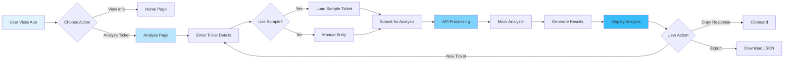

---

## Component Architecture

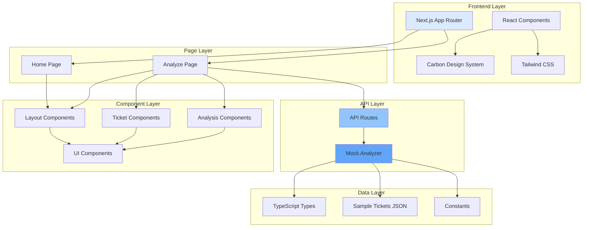

---

## Data Model Relationships

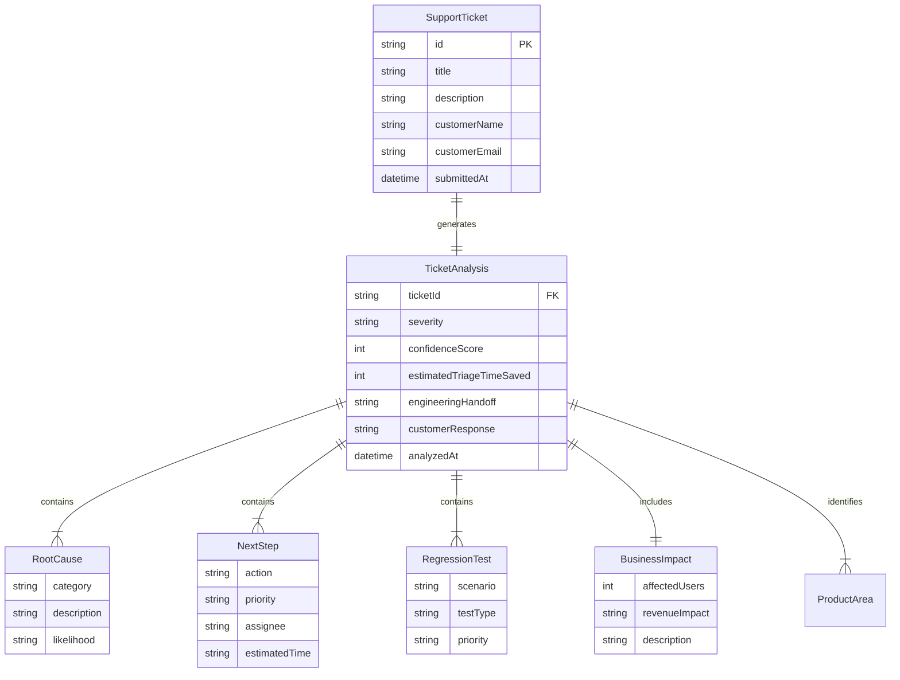

---

## API Request/Response Flow

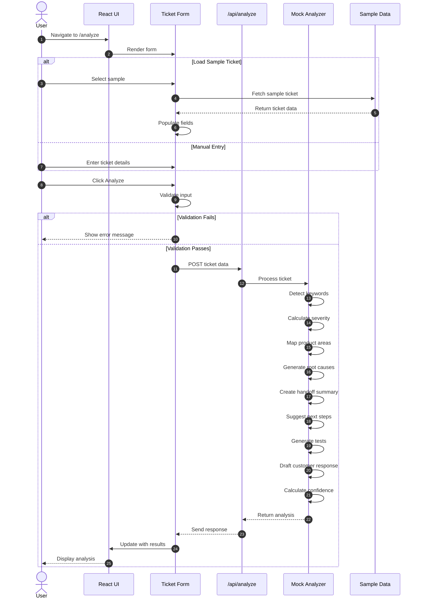

---

## Mock Analyzer Logic Flow

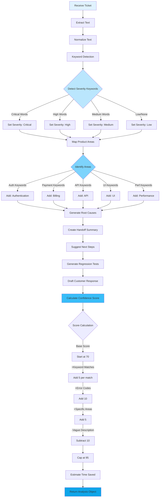

---

## Component Hierarchy

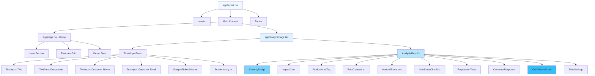

---

## File Structure Tree

```
ticket-inteli/
│
├── src/
│   ├── app/
│   │   ├── layout.tsx ..................... Root layout with Carbon theme
│   │   ├── page.tsx ....................... Home page
│   │   ├── globals.css .................... Global styles
│   │   │
│   │   ├── analyze/
│   │   │   └── page.tsx ................... Main analysis interface
│   │   │
│   │   └── api/
│   │       └── analyze/
│   │           └── route.ts ............... Mock API endpoint
│   │
│   ├── components/
│   │   ├── layout/
│   │   │   ├── Header.tsx ................. App header
│   │   │   ├── Footer.tsx ................. App footer
│   │   │   └── Sidebar.tsx ................ Navigation sidebar
│   │   │
│   │   ├── ticket/
│   │   │   ├── TicketInputForm.tsx ........ Main form component
│   │   │   ├── TicketPreview.tsx .......... Ticket display
│   │   │   └── SampleTicketSelector.tsx ... Sample loader
│   │   │
│   │   ├── analysis/
│   │   │   ├── AnalysisResults.tsx ........ Results container
│   │   │   ├── SeverityBadge.tsx .......... Severity indicator
│   │   │   ├── ImpactCard.tsx ............. Business impact
│   │   │   ├── ProductAreaTag.tsx ......... Product tags
│   │   │   ├── RootCausesList.tsx ......... Root causes
│   │   │   ├── HandoffSummary.tsx ......... Engineering handoff
│   │   │   ├── NextStepsChecklist.tsx ..... Action items
│   │   │   ├── RegressionTests.tsx ........ Test suggestions
│   │   │   ├── CustomerResponse.tsx ....... Draft response
│   │   │   ├── ConfidenceScore.tsx ........ Confidence meter
│   │   │   └── TimeSavings.tsx ............ Time saved metric
│   │   │
│   │   └── ui/
│   │       ├── LoadingSpinner.tsx ......... Loading state
│   │       ├── ErrorMessage.tsx ........... Error display
│   │       └── MetricCard.tsx ............. Metric component
│   │
│   ├── lib/
│   │   ├── types.ts ....................... TypeScript interfaces
│   │   ├── mockAnalyzer.ts ................ Analysis logic
│   │   ├── constants.ts ................... App constants
│   │   └── utils.ts ....................... Utility functions
│   │
│   ├── data/
│   │   └── sample-tickets.json ............ Sample fixtures
│   │
│   └── styles/
│       └── carbon-overrides.css ........... Theme customizations
│
├── public/
│   ├── images/
│   │   └── logo.svg ....................... App logo
│   └── favicon.ico
│
├── .env.local.example ..................... Environment template
├── .env.local ............................. Local config
├── next.config.js ......................... Next.js config
├── tailwind.config.ts ..................... Tailwind config
├── tsconfig.json .......................... TypeScript config
├── package.json ........................... Dependencies
├── README.md .............................. Documentation
├── TECHNICAL_PLAN.md ...................... This document
└── ARCHITECTURE.md ........................ Architecture diagrams
```

---

## State Management Flow

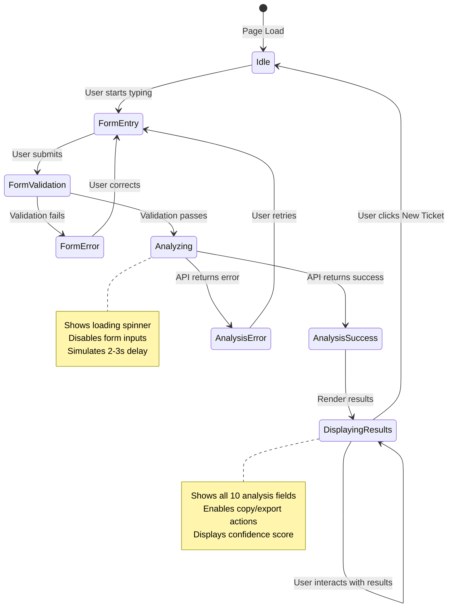

---

## Deployment Architecture (Future)

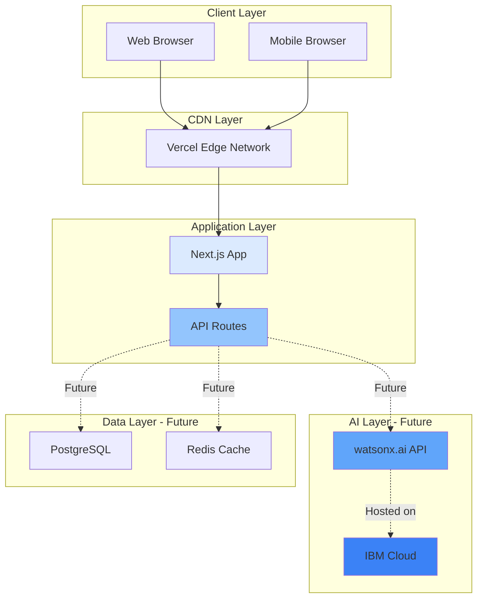

---

## Security & Error Handling

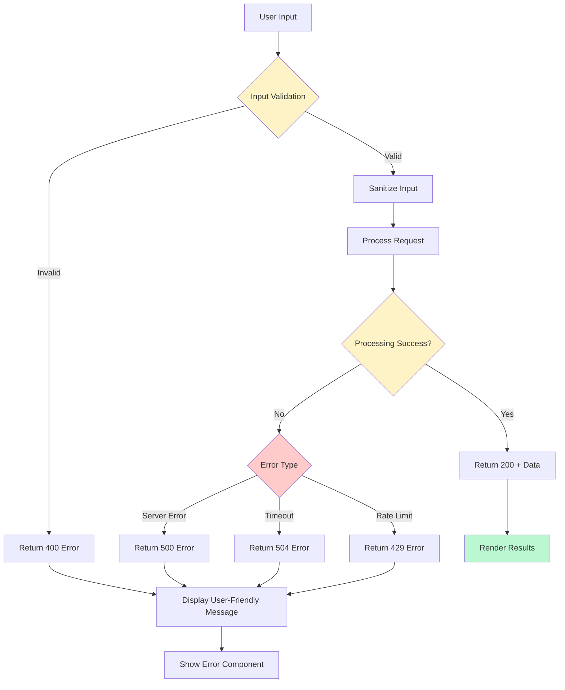

---

## Performance Optimization Strategy

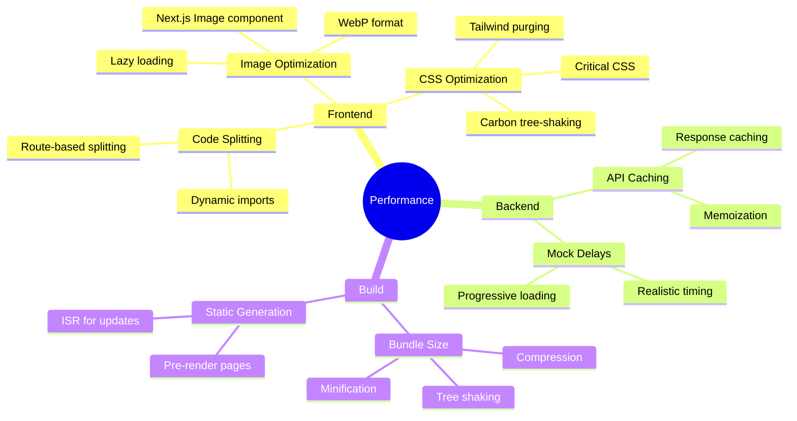

---

## Testing Strategy

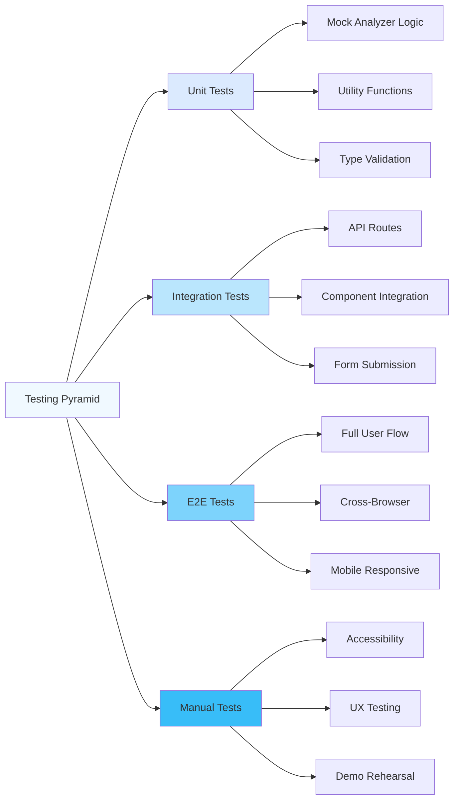

---

## Future Integration Path

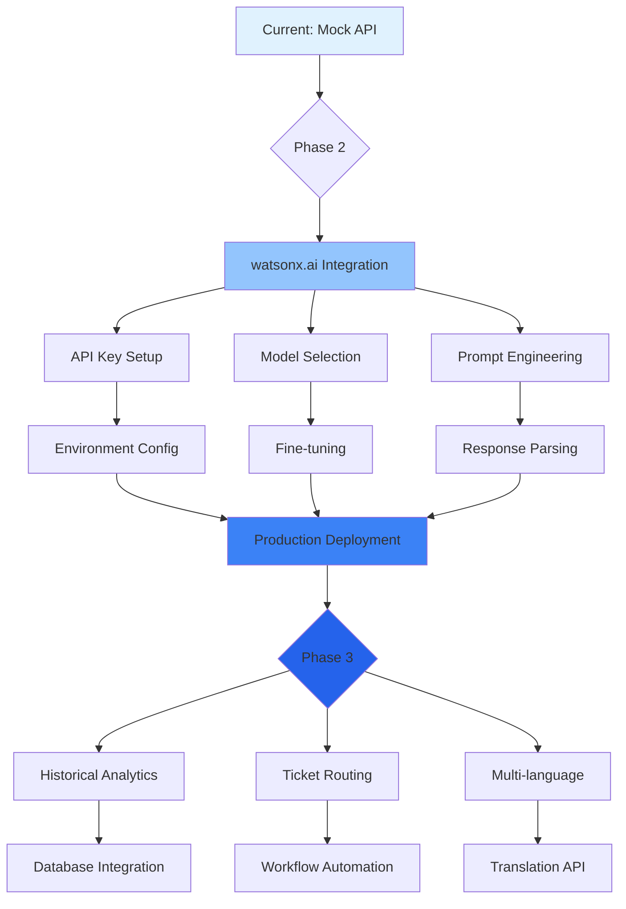

---

## Carbon Design System Integration

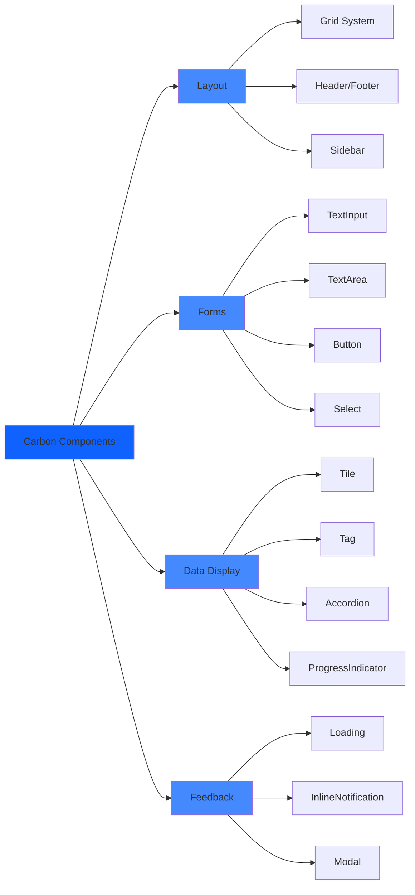

---

**Document Version:** 1.0  
**Last Updated:** 2026-05-17  
**Purpose:** Visual architecture reference for Ticket Inteli