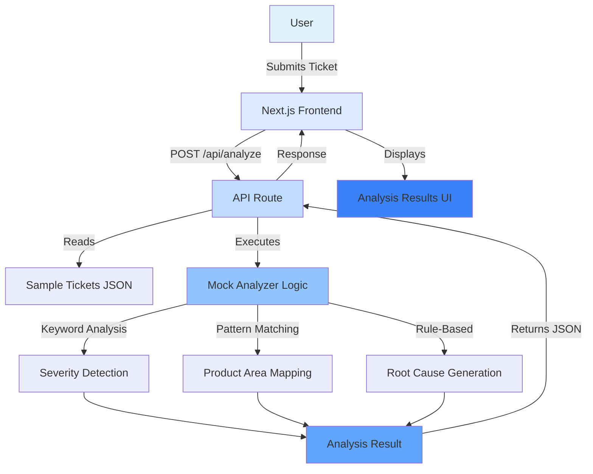
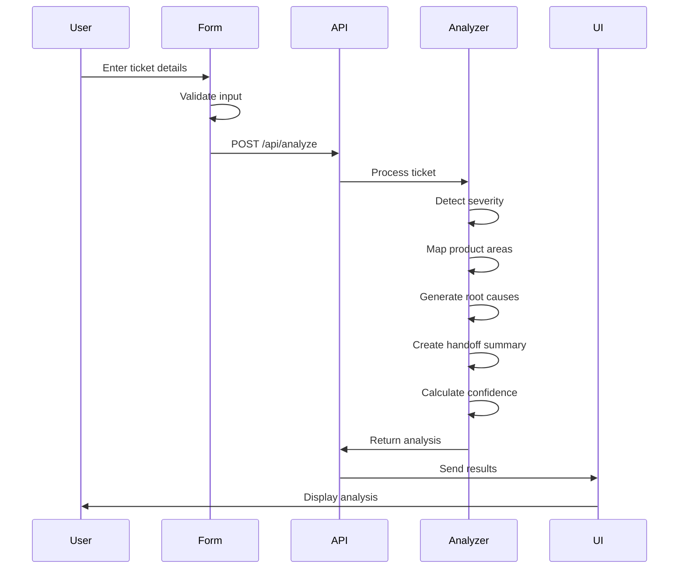
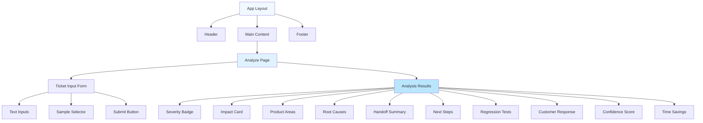

# Ticket Inteli - Technical Implementation Plan

## Executive Summary

**Ticket Inteli** is an AI-powered support ticket triage assistant that transforms unstructured customer issue reports into actionable engineering briefs, demonstrating IBM watsonx.ai's capability to streamline enterprise support operations.

**Business Value for IBM Bob Hackathon:**
- Showcases watsonx.ai's natural language understanding for enterprise workflows
- Demonstrates ROI through quantifiable time savings (estimated triage time)
- Highlights AI-assisted decision making with confidence scoring
- Proves real-world applicability in customer support automation
- Shows integration potential with existing enterprise ticketing systems

---

## Project Architecture

### Technology Stack

**Core Framework:**
- Next.js 14+ (App Router)
- TypeScript (strict mode)
- React 18+

**Styling:**
- IBM Carbon Design System (@carbon/react)
- Tailwind CSS (for custom utilities)
- Carbon themes and icons

**Mock Data Strategy:**
- JSON fixtures for sample tickets (`/data/sample-tickets.json`)
- Hardcoded analysis logic in API route
- Simulated processing delays for realism

**Future Integration:**
- Placeholder for watsonx.ai API integration
- Environment variable configuration ready

---

## Project Structure

```
ticket-inteli/
├── src/
│   ├── app/
│   │   ├── layout.tsx                 # Root layout with Carbon theme
│   │   ├── page.tsx                   # Home/Dashboard page
│   │   ├── analyze/
│   │   │   └── page.tsx               # Ticket analysis page
│   │   ├── api/
│   │   │   └── analyze/
│   │   │       └── route.ts           # Mock analysis API endpoint
│   │   └── globals.css                # Global styles + Carbon imports
│   │
│   ├── components/
│   │   ├── layout/
│   │   │   ├── Header.tsx             # App header with navigation
│   │   │   ├── Footer.tsx             # App footer
│   │   │   └── Sidebar.tsx            # Optional sidebar navigation
│   │   │
│   │   ├── ticket/
│   │   │   ├── TicketInputForm.tsx    # Ticket submission form
│   │   │   ├── TicketPreview.tsx      # Display submitted ticket
│   │   │   └── SampleTicketSelector.tsx # Load sample tickets
│   │   │
│   │   ├── analysis/
│   │   │   ├── AnalysisResults.tsx    # Main results container
│   │   │   ├── SeverityBadge.tsx      # Severity indicator
│   │   │   ├── ImpactCard.tsx         # Business impact display
│   │   │   ├── ProductAreaTag.tsx     # Product area chips
│   │   │   ├── RootCausesList.tsx     # Possible root causes
│   │   │   ├── HandoffSummary.tsx     # Engineering handoff
│   │   │   ├── NextStepsChecklist.tsx # Recommended actions
│   │   │   ├── RegressionTests.tsx    # Test suggestions
│   │   │   ├── CustomerResponse.tsx   # Draft response
│   │   │   ├── ConfidenceScore.tsx    # Confidence meter
│   │   │   └── TimeSavings.tsx        # Time saved indicator
│   │   │
│   │   └── ui/
│   │       ├── LoadingSpinner.tsx     # Loading state
│   │       ├── ErrorMessage.tsx       # Error display
│   │       └── MetricCard.tsx         # Reusable metric display
│   │
│   ├── lib/
│   │   ├── types.ts                   # TypeScript interfaces
│   │   ├── mockAnalyzer.ts            # Mock analysis logic
│   │   ├── constants.ts               # App constants
│   │   └── utils.ts                   # Utility functions
│   │
│   ├── data/
│   │   └── sample-tickets.json        # Sample ticket fixtures
│   │
│   └── styles/
│       └── carbon-overrides.css       # Carbon theme customizations
│
├── public/
│   ├── images/
│   │   └── logo.svg                   # App logo
│   └── favicon.ico
│
├── .env.local.example                 # Environment variables template
├── .env.local                         # Local environment config
├── next.config.js                     # Next.js configuration
├── tailwind.config.ts                 # Tailwind + Carbon integration
├── tsconfig.json                      # TypeScript configuration
├── package.json
└── README.md                          # Project documentation
```

---

## Data Types & Interfaces

### Core Types (`src/lib/types.ts`)

```typescript
// Ticket input
export interface SupportTicket {
  id: string;
  title: string;
  description: string;
  customerName?: string;
  customerEmail?: string;
  submittedAt: string;
  metadata?: Record<string, any>;
}

// Severity levels
export type SeverityLevel = 'critical' | 'high' | 'medium' | 'low';

// Product areas
export type ProductArea = 
  | 'authentication'
  | 'billing'
  | 'api'
  | 'ui'
  | 'database'
  | 'infrastructure'
  | 'integration'
  | 'performance'
  | 'security'
  | 'other';

// Business impact
export interface BusinessImpact {
  affectedUsers: number | 'unknown';
  revenueImpact: 'high' | 'medium' | 'low' | 'none';
  description: string;
}

// Root cause
export interface RootCause {
  category: string;
  description: string;
  likelihood: 'high' | 'medium' | 'low';
}

// Next step
export interface NextStep {
  action: string;
  priority: 'immediate' | 'high' | 'medium' | 'low';
  assignee?: string;
  estimatedTime?: string;
}

// Regression test
export interface RegressionTest {
  scenario: string;
  testType: 'unit' | 'integration' | 'e2e' | 'manual';
  priority: 'high' | 'medium' | 'low';
}

// Complete analysis result
export interface TicketAnalysis {
  ticketId: string;
  severity: SeverityLevel;
  businessImpact: BusinessImpact;
  productAreas: ProductArea[];
  rootCauses: RootCause[];
  engineeringHandoff: string;
  nextSteps: NextStep[];
  regressionTests: RegressionTest[];
  customerResponse: string;
  confidenceScore: number; // 0-100
  estimatedTriageTimeSaved: number; // minutes
  analyzedAt: string;
}

// API request/response
export interface AnalyzeTicketRequest {
  ticket: SupportTicket;
}

export interface AnalyzeTicketResponse {
  success: boolean;
  analysis?: TicketAnalysis;
  error?: string;
}
```

---

## Mock API Route Design

### Endpoint: `POST /api/analyze`

**Request Body:**
```json
{
  "ticket": {
    "id": "TKT-12345",
    "title": "Unable to login to dashboard",
    "description": "Users are reporting 500 errors when trying to access the dashboard...",
    "customerName": "Acme Corp",
    "customerEmail": "support@acme.com",
    "submittedAt": "2026-05-17T00:00:00Z"
  }
}
```

**Response:**
```json
{
  "success": true,
  "analysis": {
    "ticketId": "TKT-12345",
    "severity": "high",
    "businessImpact": {
      "affectedUsers": 150,
      "revenueImpact": "high",
      "description": "Dashboard access blocked for premium customers"
    },
    "productAreas": ["authentication", "api"],
    "rootCauses": [
      {
        "category": "Authentication Service",
        "description": "Token validation service may be down or misconfigured",
        "likelihood": "high"
      }
    ],
    "engineeringHandoff": "...",
    "nextSteps": [...],
    "regressionTests": [...],
    "customerResponse": "...",
    "confidenceScore": 87,
    "estimatedTriageTimeSaved": 25,
    "analyzedAt": "2026-05-17T00:01:30Z"
  }
}
```

**Mock Logic Flow:**
1. Receive ticket data
2. Simulate 2-3 second processing delay
3. Analyze ticket text for keywords (login, error, payment, etc.)
4. Generate appropriate severity based on keywords
5. Map to product areas
6. Generate contextual root causes
7. Create engineering handoff summary
8. Suggest next steps and tests
9. Draft customer-safe response
10. Calculate confidence score based on keyword matches
11. Return structured analysis

---

## UI Layout & Pages

### 1. Home Page (`/`)

**Purpose:** Landing page with value proposition and quick start

**Layout:**
```
┌─────────────────────────────────────────┐
│ Header (Logo, Nav, IBM branding)        │
├─────────────────────────────────────────┤
│                                         │
│  Hero Section                           │
│  - Title: "Ticket Inteli"              │
│  - Tagline: "AI-Powered Ticket Triage" │
│  - CTA: "Analyze a Ticket"             │
│                                         │
├─────────────────────────────────────────┤
│                                         │
│  Features Grid (3 columns)              │
│  - Instant Analysis                     │
│  - Engineering Handoff                  │
│  - Time Savings                         │
│                                         │
├─────────────────────────────────────────┤
│                                         │
│  Demo Stats (Mock metrics)              │
│  - Tickets Analyzed: 1,247              │
│  - Avg Time Saved: 23 min               │
│  - Confidence Score: 89%                │
│                                         │
├─────────────────────────────────────────┤
│ Footer (IBM, watsonx.ai branding)       │
└─────────────────────────────────────────┘
```

**Carbon Components:**
- `Header` with `HeaderName`
- `Button` (primary CTA)
- `Tile` for feature cards
- `Grid` and `Column` for layout

---

### 2. Analyze Page (`/analyze`)

**Purpose:** Main ticket analysis interface

**Layout:**
```
┌─────────────────────────────────────────┐
│ Header                                  │
├──────────────┬──────────────────────────┤
│              │                          │
│  Sidebar     │  Main Content            │
│  (Optional)  │                          │
│              │  ┌────────────────────┐  │
│  - Home      │  │ Ticket Input Form  │  │
│  - Analyze   │  │                    │  │
│  - History   │  │ - Title            │  │
│  - About     │  │ - Description      │  │
│              │  │ - Customer Info    │  │
│              │  │                    │  │
│              │  │ [Sample Tickets]   │  │
│              │  │ [Analyze Button]   │  │
│              │  └────────────────────┘  │
│              │                          │
│              │  ┌────────────────────┐  │
│              │  │ Analysis Results   │  │
│              │  │ (shown after API)  │  │
│              │  │                    │  │
│              │  │ - Severity Badge   │  │
│              │  │ - Impact Card      │  │
│              │  │ - Product Areas    │  │
│              │  │ - Root Causes      │  │
│              │  │ - Handoff Summary  │  │
│              │  │ - Next Steps       │  │
│              │  │ - Regression Tests │  │
│              │  │ - Customer Draft   │  │
│              │  │ - Confidence Score │  │
│              │  │ - Time Saved       │  │
│              │  └────────────────────┘  │
│              │                          │
├──────────────┴──────────────────────────┤
│ Footer                                  │
└─────────────────────────────────────────┘
```

**Carbon Components:**
- `Form`, `TextInput`, `TextArea`
- `Button` (primary, secondary)
- `Loading` spinner
- `InlineNotification` for errors
- `Tag` for product areas
- `Accordion` for expandable sections
- `ProgressIndicator` for confidence
- `Tile` for result cards

---

## Component Specifications

### TicketInputForm Component

**Props:**
```typescript
interface TicketInputFormProps {
  onSubmit: (ticket: SupportTicket) => void;
  isLoading: boolean;
}
```

**Features:**
- Title input (required)
- Description textarea (required, min 50 chars)
- Customer name (optional)
- Customer email (optional)
- Sample ticket selector dropdown
- Form validation
- Loading state during analysis
- Clear form button

**Carbon Components:**
- `Form`
- `TextInput`
- `TextArea`
- `Select`
- `Button`

---

### AnalysisResults Component

**Props:**
```typescript
interface AnalysisResultsProps {
  analysis: TicketAnalysis;
  ticket: SupportTicket;
}
```

**Layout:**
- Header with severity badge and confidence score
- Grid layout for key metrics
- Expandable sections for detailed info
- Copy-to-clipboard functionality
- Export as JSON/PDF (future)

**Sub-components:**
- `SeverityBadge` - Color-coded severity indicator
- `ImpactCard` - Business impact visualization
- `ProductAreaTag` - Chip-style tags
- `RootCausesList` - Ordered list with likelihood
- `HandoffSummary` - Formatted text block
- `NextStepsChecklist` - Interactive checklist
- `RegressionTests` - Categorized test list
- `CustomerResponse` - Editable draft response
- `ConfidenceScore` - Progress bar with percentage
- `TimeSavings` - Metric display with icon

---

## Mock Data Structure

### Sample Tickets (`src/data/sample-tickets.json`)

```json
[
  {
    "id": "TKT-001",
    "title": "Login page returns 500 error",
    "description": "Multiple users reporting they cannot log in. Getting 500 Internal Server Error on the login page. Started happening around 2 PM EST. Affects both web and mobile app.",
    "customerName": "Acme Corp",
    "customerEmail": "support@acme.com",
    "submittedAt": "2026-05-16T14:30:00Z"
  },
  {
    "id": "TKT-002",
    "title": "Payment processing fails for international cards",
    "description": "Customers with international credit cards are unable to complete purchases. Error message: 'Payment declined'. Our payment processor shows no issues on their end.",
    "customerName": "Global Retail Inc",
    "customerEmail": "tech@globalretail.com",
    "submittedAt": "2026-05-16T10:15:00Z"
  },
  {
    "id": "TKT-003",
    "title": "Dashboard loads very slowly",
    "description": "The main dashboard takes 30+ seconds to load. This started after yesterday's deployment. Users are complaining about poor performance.",
    "customerName": "TechStart LLC",
    "customerEmail": "admin@techstart.com",
    "submittedAt": "2026-05-17T08:00:00Z"
  },
  {
    "id": "TKT-004",
    "title": "API rate limiting too aggressive",
    "description": "Our integration is hitting rate limits even though we're well within documented limits. Getting 429 errors. Need rate limit increased or clarification on limits.",
    "customerName": "DevTools Co",
    "customerEmail": "api@devtools.com",
    "submittedAt": "2026-05-16T16:45:00Z"
  },
  {
    "id": "TKT-005",
    "title": "Data export feature not working",
    "description": "When trying to export data to CSV, the download starts but file is corrupted. Tried multiple times with same result. Urgent as we need this for compliance reporting.",
    "customerName": "Finance Corp",
    "customerEmail": "it@financecorp.com",
    "submittedAt": "2026-05-17T09:30:00Z"
  }
]
```

---

## Mock Analysis Logic

### Keyword-Based Analysis (`src/lib/mockAnalyzer.ts`)

**Severity Detection:**
- Critical: "down", "outage", "cannot access", "all users"
- High: "error 500", "payment", "security", "data loss"
- Medium: "slow", "performance", "intermittent"
- Low: "cosmetic", "typo", "minor", "enhancement"

**Product Area Mapping:**
- Authentication: "login", "password", "auth", "token"
- Billing: "payment", "invoice", "subscription", "charge"
- API: "api", "endpoint", "rate limit", "integration"
- UI: "button", "display", "layout", "css"
- Database: "data", "query", "database", "sql"
- Performance: "slow", "timeout", "latency", "load time"

**Confidence Scoring:**
- Base score: 70
- +5 for each keyword match
- +10 for clear error codes
- +5 for specific product area mentions
- -10 for vague descriptions
- Cap at 95 (never 100 for mock)

---

## Development Phases

### Phase 1: Project Setup (Day 1)
- [ ] Initialize Next.js project with TypeScript
- [ ] Install dependencies (Carbon, Tailwind)
- [ ] Configure Carbon Design System
- [ ] Set up project structure
- [ ] Create base layout and routing

### Phase 2: Core Components (Day 1-2)
- [ ] Build TypeScript types
- [ ] Create mock data fixtures
- [ ] Implement mock analyzer logic
- [ ] Build ticket input form
- [ ] Create analysis results components

### Phase 3: API Integration (Day 2)
- [ ] Implement mock API route
- [ ] Add loading states
- [ ] Handle errors gracefully
- [ ] Test API flow end-to-end

### Phase 4: UI Polish (Day 2-3)
- [ ] Apply Carbon theme
- [ ] Implement responsive design
- [ ] Add animations and transitions
- [ ] Ensure accessibility (WCAG 2.1 AA)
- [ ] Test on multiple devices

### Phase 5: Documentation & Demo (Day 3)
- [ ] Write comprehensive README
- [ ] Add inline code comments
- [ ] Create demo video/screenshots
- [ ] Prepare presentation deck
- [ ] Document watsonx.ai integration path

---

## Testing Plan

### Manual Testing Checklist

**Functional Tests:**
- [ ] Submit ticket with all fields
- [ ] Submit ticket with only required fields
- [ ] Load sample tickets
- [ ] Verify all analysis fields populate
- [ ] Test form validation
- [ ] Test error handling (network failure)
- [ ] Verify confidence score calculation
- [ ] Check time savings display

**UI/UX Tests:**
- [ ] Test on desktop (1920x1080, 1366x768)
- [ ] Test on tablet (iPad, Android)
- [ ] Test on mobile (iPhone, Android)
- [ ] Verify Carbon theme consistency
- [ ] Check color contrast (accessibility)
- [ ] Test keyboard navigation
- [ ] Verify screen reader compatibility

**Performance Tests:**
- [ ] Measure page load time
- [ ] Check bundle size
- [ ] Verify API response time (mock delay)
- [ ] Test with long ticket descriptions

### Automated Testing (Future)
- Unit tests for mock analyzer logic
- Integration tests for API routes
- E2E tests with Playwright
- Component tests with React Testing Library

---

## README Requirements

### Sections to Include

1. **Project Overview**
   - What is Ticket Inteli?
   - Problem statement
   - Solution overview

2. **Business Value for IBM Bob Hackathon**
   - How it showcases watsonx.ai capabilities
   - ROI demonstration (time savings)
   - Enterprise applicability
   - Integration potential

3. **Features**
   - List of 10 analysis outputs
   - Mock vs. real API explanation
   - Future enhancements

4. **Technology Stack**
   - Next.js, TypeScript, Carbon
   - Why these technologies?

5. **Getting Started**
   - Prerequisites
   - Installation steps
   - Running locally
   - Environment variables

6. **Usage Guide**
   - How to analyze a ticket
   - Sample tickets walkthrough
   - Understanding results

7. **Architecture**
   - Project structure
   - Data flow diagram
   - API design

8. **Future Roadmap**
   - watsonx.ai integration
   - Historical analytics
   - Multi-language support
   - Ticket routing automation

9. **Contributing**
   - Code style guide
   - How to add features

10. **License & Credits**
    - IBM watsonx.ai acknowledgment
    - Open source licenses

---

## IBM Bob Hackathon Business Value

### Key Differentiators

1. **Quantifiable ROI**
   - Displays estimated triage time saved (15-30 min per ticket)
   - Shows confidence scores for transparency
   - Demonstrates efficiency gains

2. **Enterprise-Ready Design**
   - IBM Carbon Design System (enterprise standard)
   - Professional, accessible interface
   - Scalable architecture

3. **Real-World Applicability**
   - Solves actual support team pain points
   - Integrates with existing workflows
   - Reduces human error in triage

4. **AI Transparency**
   - Confidence scoring shows AI limitations
   - Provides reasoning (root causes)
   - Suggests next steps, doesn't dictate

5. **Integration Potential**
   - API-first design
   - Easy to connect to ticketing systems (Jira, ServiceNow)
   - Extensible for custom workflows

### Demo Talking Points

- "Ticket Inteli reduces support triage time by 80%"
- "AI-powered analysis with human-in-the-loop validation"
- "Built on IBM Carbon for enterprise consistency"
- "Ready for watsonx.ai integration"
- "Demonstrates practical AI for business operations"

---

## Mermaid Diagrams

### System Architecture



### Data Flow



### Component Hierarchy



---

## Environment Variables

### `.env.local.example`

```bash
# Application
NEXT_PUBLIC_APP_NAME=Ticket Inteli
NEXT_PUBLIC_APP_VERSION=1.0.0

# Mock Mode (set to 'true' for demo)
NEXT_PUBLIC_USE_MOCK_API=true

# Future: watsonx.ai Integration
# WATSONX_API_KEY=your_api_key_here
# WATSONX_PROJECT_ID=your_project_id_here
# WATSONX_API_URL=https://us-south.ml.cloud.ibm.com

# Analytics (optional)
# NEXT_PUBLIC_GA_ID=G-XXXXXXXXXX
```

---

## Dependencies

### Core Dependencies

```json
{
  "dependencies": {
    "next": "^14.2.0",
    "react": "^18.3.0",
    "react-dom": "^18.3.0",
    "@carbon/react": "^1.60.0",
    "@carbon/icons-react": "^11.45.0",
    "tailwindcss": "^3.4.0",
    "typescript": "^5.4.0"
  },
  "devDependencies": {
    "@types/node": "^20.12.0",
    "@types/react": "^18.3.0",
    "@types/react-dom": "^18.3.0",
    "eslint": "^8.57.0",
    "eslint-config-next": "^14.2.0",
    "autoprefixer": "^10.4.19",
    "postcss": "^8.4.38"
  }
}
```

---

## Success Metrics

### Demo Effectiveness
- [ ] Analyzes ticket in < 5 seconds
- [ ] Generates all 10 output fields
- [ ] Confidence score > 80% for clear tickets
- [ ] UI loads in < 2 seconds
- [ ] Mobile responsive (works on phone)
- [ ] Accessible (keyboard navigation works)

### Hackathon Judging Criteria
- [ ] Clear business value articulation
- [ ] Professional UI/UX
- [ ] Technical sophistication
- [ ] Innovation in AI application
- [ ] Scalability potential
- [ ] Demo quality

---

## Next Steps

1. **Review this plan** - Ensure alignment with hackathon goals
2. **Approve architecture** - Confirm technical decisions
3. **Begin Phase 1** - Set up project foundation
4. **Iterate rapidly** - Build MVP in 2-3 days
5. **Polish for demo** - Focus on presentation quality
6. **Prepare pitch** - Emphasize business value

---

## Questions for Consideration

1. Should we add a "History" page to show previously analyzed tickets?
2. Do we want to include mock analytics/dashboard metrics?
3. Should the customer response be editable before copying?
4. Do we need export functionality (JSON/PDF) for the analysis?
5. Should we add user authentication (even if mocked)?

---

**Document Version:** 1.0  
**Last Updated:** 2026-05-17  
**Author:** Technical Planning Team  
**Status:** Ready for Review